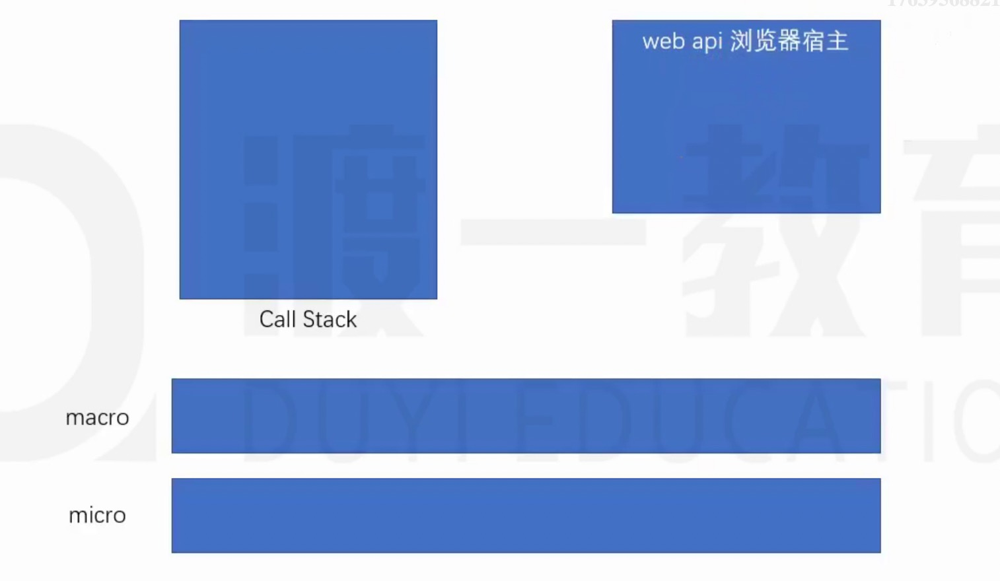

# [回顾]事件循环

JS运行的环境称之为宿主环境。

执行栈：call stack，一个数据结构，用于存放各种函数的执行环境，每一个函数执行之前，它的相关信息会加入到执行栈。函数调用之前，创建执行环境，然后加入到执行栈；函数调用之后，销毁执行环境。

JS引擎永远执行的是执行栈的最顶部。

异步函数：某些函数不会立即执行，需要等到某个时机到达后才会执行，这样的函数称之为异步函数。比如事件处理函数。异步函数的执行时机，会被宿主环境控制。

浏览器宿主环境中包含5个线程：

1. JS引擎：负责执行执行栈的最顶部代码
2. GUI线程：负责渲染页面 
3. 事件监听线程：负责监听各种事件
4. 计时线程：负责计时
5. 网络线程：负责网络通信

当上面的线程发生了某些事请，如果该线程发现，这件事情有处理程序，它会将该处理程序加入一个叫做事件队列的内存。当JS引擎发现，执行栈中已经没有了任何内容后，会将事件队列中的第一个函数加入到执行栈中执行。

JS引擎对事件队列的取出执行方式，以及与宿主环境的配合，称之为事件循环。

事件队列在不同的宿主环境中有所差异，大部分宿主环境会将事件队列进行细分。在浏览器中，事件队列分为两种：

- 宏任务（队列）：macroTask，计时器结束的回调、事件回调、http回调等等绝大部分异步函数进入宏队列
- 微任务（队列）：MutationObserver，Promise产生的回调进入微队列

> MutationObserver用于监听某个DOM对象的变化

当执行栈清空时，JS引擎首先会将微任务中的所有任务依次执行结束，如果没有微任务，则执行宏任务。

