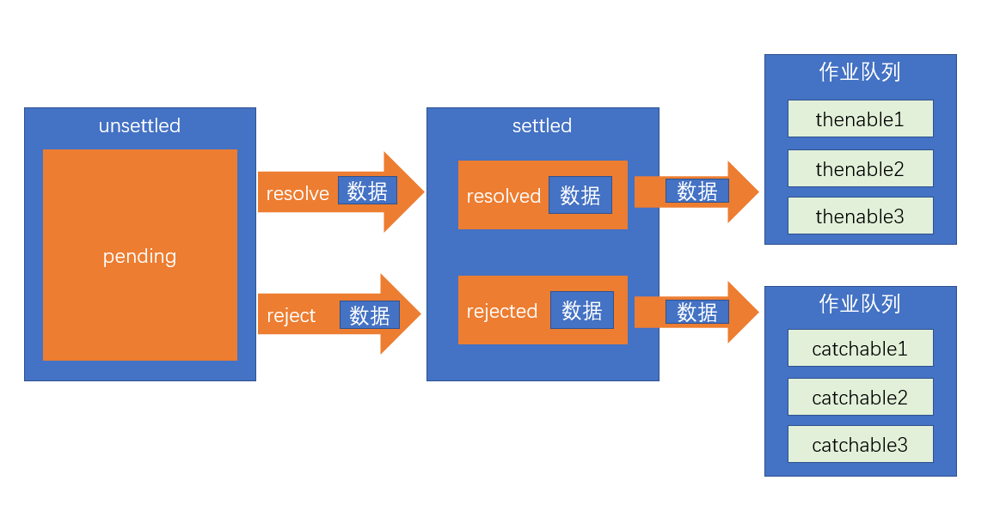
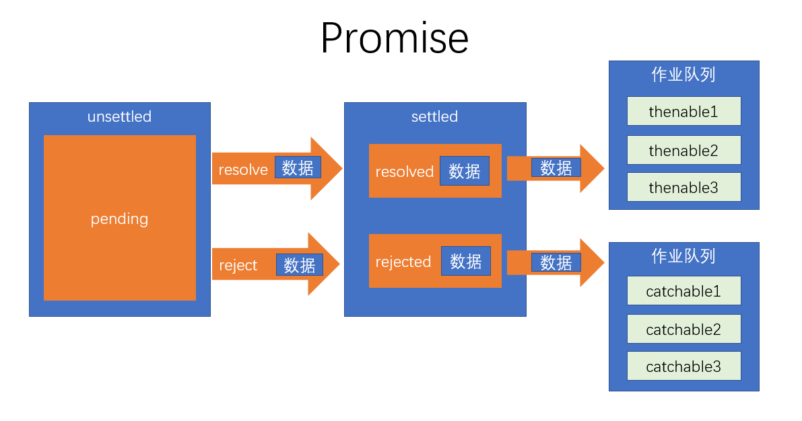

# 8-2. 异步处理的通用模型

ES官方参考了大量的异步场景，总结出了一套异步的通用模型，该模型可以覆盖几乎所有的异步场景，甚至是同步场景。

值得注意的是，为了兼容旧系统，ES6 并不打算抛弃掉过去的做法，只是基于该模型推出一个全新的 API，使用该API，会让异步处理更加的简洁优雅。

理解该 API，最重要的，是理解它的异步模型

1. ES6 将某一件可能发生异步操作的事情，分为两个阶段：**unsettled** 和 **settled**

- unsettled： 未决阶段，表示事情还在进行前期的处理，并没有发生通向结果的那件事
- settled：已决阶段，事情已经有了一个结果，不管这个结果是好是坏，整件事情无法逆转

事情总是从 未决阶段 逐步发展到 已决阶段的。并且，未决阶段拥有控制何时通向已决阶段的能力。

2. ES6将事情划分为三种状态： pending、resolved、rejected

- pending: 挂起，处于未决阶段，则表示这件事情还在挂起（最终的结果还没出来）
- resolved：已处理，已决阶段的一种状态，表示整件事情已经出现结果，并是一个可以按照正常逻辑进行下去的结果
- rejected：已拒绝，已决阶段的一种状态，表示整件事情已经出现结果，并是一个无法按照正常逻辑进行下去的结果，通常用于表示有一个错误

既然未决阶段有权力决定事情的走向，因此，未决阶段可以决定事情最终的状态！

我们将 把事情变为resolved状态的过程叫做：**resolve**，推向该状态时，可能会传递一些数据

我们将 把事情变为rejected状态的过程叫做：**reject**，推向该状态时，同样可能会传递一些数据，通常为错误信息

**始终记住，无论是阶段，还是状态，是不可逆的！**

3. 当事情达到已决阶段后，通常需要进行后续处理，不同的已决状态，决定了不同的后续处理。

- resolved状态：这是一个正常的已决状态，后续处理表示为 thenable
- rejected状态：这是一个非正常的已决状态，后续处理表示为 catchable

后续处理可能有多个，因此会形成作业队列，这些后续处理会按照顺序，当状态到达后依次执行

4. 整件事称之为Promise

**理解上面的概念，对学习Promise至关重要！**