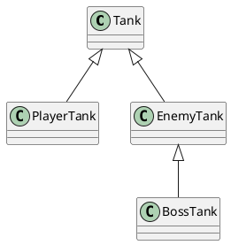

# 类的继承

## 继承的作用

继承可以描述类与类之间的关系

> 坦克、玩家坦克、敌方坦克
> 玩家坦克是坦克，敌方坦克是坦克

如果A和B都是类，并且可以描述为A是B，则A和B形成继承关系：

- B是父类，A是子类
- B派生A，A继承自B
- B是A的基类，A是B的派生类

如果A继承自B，则A中自动拥有B中的所有成员

## 成员的重写

重写(override)：子类中覆盖父类的成员

子类成员不能改变父类成员的类型

无论是属性还是方法，子类都可以对父类的相应成员进行重写，但是重写时，需要保证类型的匹配。

注意this关键字：在继承关系中，this的指向是动态——调用方法时，根据具体的调用者确定this指向

super关键字：在子类的方法中，可以使用super关键字读取父类成员

## 类型匹配

鸭子辨型法

子类的对象，始终可以赋值给父类

面向对象中，这种现象，叫做里氏替换原则

如果需要判断一个数据的具体子类类型，可以使用instanceof

## protected修饰符

readonly：只读修饰符

访问权限修饰符：private public protected

protected: 受保护的成员，只能在自身和子类中访问

## 单根性和传递性

单根性：每个类最多只能拥有一个父类

传递性：如果A是B的父类，并且B是C的父类，则，可以认为A也是C的父类

